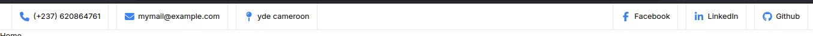

# Cours Tailwind CSS

Ce document couvre les éléments et concepts de Tailwind CSS utilisés dans la création du composant `MyNav` pour un projet Next.js. Les sections sont regroupées par compétence visée.

## 1. **Aligner des Éléments**

Pour aligner les éléments, vous pouvez utiliser les classes de flexbox de Tailwind CSS. Ces classes permettent de gérer l'alignement, la disposition et la justification des éléments dans un conteneur.

- **`flex`** : Définit un conteneur flex pour les éléments enfants. Les éléments enfants seront alors disposés en ligne ou en colonne.
- **`justify-between`** : Distribue les éléments enfants de manière égale avec le premier élément aligné à gauche et le dernier élément aligné à droite.
- **`items-center`** : Aligne les éléments enfants au centre du conteneur en termes de hauteur.
- **`space-x-4`** : Ajoute un espace horizontal de 1rem (16px) entre les éléments enfants du conteneur flex.

### Variantes

- **`justify-start`** : Aligne les éléments enfants au début du conteneur.
- **`justify-end`** : Aligne les éléments enfants à la fin du conteneur.
- **`items-start`** : Aligne les éléments enfants au début du conteneur en termes de hauteur.
- **`items-end`** : Aligne les éléments enfants à la fin du conteneur en termes de hauteur.

## 2. **Ajouter des Bordures**

Pour ajouter des bordures à vos éléments, vous utilisez les classes de bordure de Tailwind CSS. Vous pouvez spécifier l'épaisseur, la couleur et le côté de la bordure.

- **`border`** : Ajoute une bordure de 1px à tous les côtés de l'élément.
- **`border-t`** : Ajoute une bordure uniquement en haut.
- **`border-b`** : Ajoute une bordure uniquement en bas.
- **`border-l`** : Ajoute une bordure uniquement à gauche.
- **`border-r`** : Ajoute une bordure uniquement à droite.
- **`border-gray-200`** : Définit la couleur de la bordure comme gris clair (niveau de gris 200).
- **`border-2`** : Définit une bordure plus épaisse (2px).

### Variantes

- **`border-red-500`** : Change la couleur de la bordure en rouge foncé (niveau de rouge 500).
- **`border-dashed`** : Définit la bordure comme étant en pointillés.
- **`border-dotted`** : Définit la bordure comme étant en pointillés.

## 3. **Gérer le Padding et le Margin**

Le padding et le margin contrôlent l'espace autour des éléments internes et externes.

- **`p-4`** : Définit un padding uniforme de 1rem (16px) sur tous les côtés de l'élément.
- **`m-4`** : Définit une marge uniforme de 1rem (16px) autour de l'élément.
- **`space-x-2`** : Ajoute un espace horizontal de 0.5rem (8px) entre les éléments enfants du conteneur flex.

### Variantes

- **`p-2`** : Définit un padding de 0.5rem (8px).
- **`p-6`** : Définit un padding de 1.5rem (24px).
- **`m-2`** : Définit une marge de 0.5rem (8px).
- **`m-6`** : Définit une marge de 1.5rem (24px).

## 4. **Configurer la Couleur des Icônes**

Pour les icônes Font Awesome, vous pouvez utiliser les classes Tailwind pour gérer la couleur et la taille.

- **`text-blue-500`** : Définit la couleur du texte (et des icônes) comme bleu foncé (niveau de bleu 500).
- **`h-5 w-5`** : Définit la hauteur et la largeur de l'icône à 1.25rem (20px).

### Variantes

- **`text-red-500`** : Change la couleur du texte en rouge foncé.
- **`text-green-500`** : Change la couleur du texte en vert foncé.
- **`h-6 w-6`** : Définit la hauteur et la largeur de l'icône à 1.5rem (24px).

## 5. **Utilisation de Font Awesome**

Pour intégrer des icônes Font Awesome dans votre projet, vous devez d'abord installer la bibliothèque Font Awesome et l'importer dans votre composant.

### Installation

        ```bash
        npm install @fortawesome/react-fontawesome @fortawesome/free-solid-svg-icons @fortawesome/free-brands-svg-icons
    
### Importation et Utilisation
    
    tsx
    
    import { FontAwesomeIcon } from '@fortawesome/react-fontawesome';
    import { faPhone, faEnvelope, faMapPin } from '@fortawesome/free-solid-svg-icons';
    import { faFacebookF, faLinkedinIn, faGithub } from '@fortawesome/free-brands-svg-icons';
#### Exemple d'Utilisation

    tsx
    
    <FontAwesomeIcon icon={faPhone} className="h-5 w-5 text-blue-500" />
# Ressources pour Apprendre à Utiliser Font Awesome

Pour approfondir vos connaissances sur l'utilisation des icônes Font Awesome, voici quelques ressources utiles :

1. **[Documentation Officielle de Font Awesome](https://fontawesome.com/docs)**
   La documentation officielle fournit des informations complètes sur l'utilisation des icônes, y compris les différentes classes d'icônes disponibles et des exemples de code.

   2. **[Bibliothèque d'icônes Font Awesome Free](https://fontawesome.com/icons?d=gallery&s=brands)**
      Explorez les icônes disponibles dans les catégories "Free" (gratuites) et "Brands" (marques). Vous y trouverez des icônes pour les réseaux sociaux, les outils et plus encore.

   3. **[Guide d'Utilisation des Icônes Font Awesome avec React](https://fontawesome.com/docs/web/use-with/react/)**
      Ce guide explique comment intégrer Font Awesome dans une application React, ce qui est utile pour votre projet Next.js.

   4. **[Documentation de Font Awesome pour les Icônes Solid](https://fontawesome.com/icons?d=gallery&m=free&s=solid)**
      Trouvez toutes les icônes de la collection "Solid" et comment les utiliser avec des exemples de code.

   5. **[Font Awesome Cheatsheet](https://fontawesome.com/cheatsheet)**
      Une feuille de triche qui liste toutes les icônes disponibles avec leurs classes et noms.

## Effets dans le Composant MyNav

### Changement de Couleur au Survol des Liens

Pour améliorer l'interaction utilisateur, les éléments de la barre de navigation changent de couleur lorsque l'on passe la souris dessus. Voici les classes Tailwind CSS utilisées pour cet effet :

- `hover:bg-blue-100` : Change la couleur de fond au survol en bleu clair.
- `hover:text-blue-500` : Change la couleur du texte au survol en bleu foncé.

### Copier le Numéro de Téléphone au Clic

Pour permettre la copie du numéro de téléphone dans le presse-papiers lorsqu'il est cliqué, la fonction JavaScript suivante est utilisée :
    
    ```typescript
    function copyToClipboard(text: string) {
        navigator.clipboard.writeText(text).then(function() {
            alert('Number copied to clipboard!');
        }, function(err) {
            console.error('Could not copy text: ', err);
        });
    }

## code complet du composant:
              import Link from "next/link";
        import { FontAwesomeIcon } from '@fortawesome/react-fontawesome';
        import { faEnvelope, faPhone, faMapPin } from '@fortawesome/free-solid-svg-icons';
        import { faFacebookF, faLinkedinIn, faGithub } from '@fortawesome/free-brands-svg-icons';
        
        export default function MyNav() {
        return (
        <nav className="h-14 w-full flex justify-between items-center p-6 border-b border-gray-200">
        <div className="flex space-x-4">
        <div
        className="border border-gray-200 p-4 flex items-center space-x-2 hover:bg-blue-100 hover:text-blue-500 transition-colors duration-300 cursor-pointer"
        onClick={() => copyToClipboard("(+237) 620864761")}
        >
        <FontAwesomeIcon icon={faPhone} className="h-5 w-5 text-blue-500" />
        <div>(+237) 620864761</div>
        </div>
        
                        <Link href="mailto:mymail@example.com" className="border border-gray-200 p-4 flex items-center space-x-4 hover:bg-blue-100 hover:text-blue-500 transition-colors duration-300">
                            <FontAwesomeIcon icon={faEnvelope} className="h-5 w-5 text-blue-500" />
                            <div>mymail@example.com</div>
                        </Link>
        
                        <div className="border border-gray-200 p-4 flex items-center space-x-2 hover:bg-blue-100 hover:text-blue-500 transition-colors duration-300">
                            <FontAwesomeIcon icon={faMapPin} className="h-5 w-5 text-blue-500" />
                            <div>yde cameroon</div>
                        </div>
                    </div>
                    <div className="flex space-x-4">
                        <Link href="#" className="border border-gray-200 p-4 flex items-center space-x-2 hover:bg-blue-100 hover:text-blue-500 transition-colors duration-300">
                            <FontAwesomeIcon icon={faFacebookF} className="h-5 w-5 text-blue-500" />
                            <div>Facebook</div>
                        </Link>
                        <Link href="#" className="border border-gray-200 p-4 flex items-center space-x-2 hover:bg-blue-100 hover:text-blue-500 transition-colors duration-300">
                            <FontAwesomeIcon icon={faLinkedinIn} className="h-5 w-5 text-blue-500" />
                            <div>LinkedIn</div>
                        </Link>
                        <Link href="#" className="border border-gray-200 p-4 flex items-center space-x-2 hover:bg-blue-100 hover:text-blue-500 transition-colors duration-300">
                            <FontAwesomeIcon icon={faGithub} className="h-5 w-5 text-blue-500" />
                            <div>Github</div>
                        </Link>
                    </div>
                </nav>
            );
        }

function copyToClipboard(text: string) {
navigator.clipboard.writeText(text).then(function() {
alert('Number copied to clipboard!');
}, function(err) {
console.error('Could not copy text: ', err);
});
}

### rendu: 



    
        